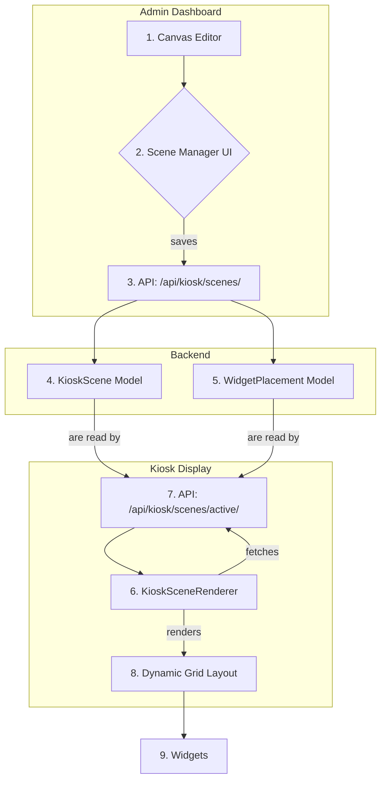

# 🎬 Kiosk Scenes - Αρχιτεκτονική Δυναμικών Layouts

## 🎯 1. Στόχος

Αυτό το έγγραφο περιγράφει την τεχνική αρχιτεκτονική για τη μετάβαση του Kiosk από ένα στατικό, ενιαίο layout σε ένα δυναμικό σύστημα **"Σκηνών" (Scenes)**. Ο στόχος είναι να δημιουργηθεί μια πιο ζωντανή, ελκυστική και σχετική με το περιεχόμενο εμπειρία για τον χρήστη, επιτρέποντας την εναλλαγή μεταξύ διαφορετικών διατάξεων και θεματικών ενοτήτων.

---

## 核心 2. Βασικές Έννοιες

-   **Σκηνή (Scene):** Μια "Σκηνή" είναι ένα πλήρες, αυτόνομο layout για την οθόνη του Kiosk. Κάθε σκηνή ορίζει:
    -   Ποια widgets εμφανίζονται.
    -   Πού και πόσο μεγάλο εμφανίζεται κάθε widget (η θέση και το μέγεθός του στο grid).
    -   Πόση ώρα θα παραμείνει ενεργή η σκηνή (`duration`).
    -   Πώς θα γίνει η μετάβαση στην επόμενη σκηνή (`transition`).
    -   Πότε μπορεί να είναι ενεργή (π.χ. κανόνες βάσει ώρας).

-   **Κύκλος Σκηνών (Scene Cycle):** Το Kiosk δεν θα εναλλάσσει πλέον μεμονωμένα widgets, αλλά ολόκληρες "Σκηνές" σε έναν προκαθορισμένο ή δυναμικό κύκλο.

---

## 🏗️ 3. Αρχιτεκτονική

Η νέα αρχιτεκτονική επεκτείνει το υπάρχον σύστημα του `Canvas Editor` και των widgets, εισάγοντας νέα μοντέλα στη βάση δεδομένων για την αποθήκευση των σκηνών.



---

## 🔩 4. Τεχνική Υλοποίηση (Backend)

Θα δημιουργήσουμε δύο νέα μοντέλα για να υποστηρίξουμε τις Σκηνές.

### Νέα Models (`kiosk/models.py`)

1.  **`KioskScene`**: Αποθηκεύει τις ιδιότητες κάθε σκηνής.

    ```python
    class KioskScene(models.Model):
        kiosk_config = models.ForeignKey('KioskWidgetConfig', on_delete=models.CASCADE, related_name='scenes')
        name = models.CharField(max_length=100)
        order = models.PositiveIntegerField(default=0)
        duration_seconds = models.PositiveIntegerField(default=30, help_text="Duration in seconds")
        transition = models.CharField(max_length=50, default='fade') # e.g., 'fade', 'slide'
        is_enabled = models.BooleanField(default=True)
        
        # Time-based activation (optional)
        active_start_time = models.TimeField(null=True, blank=True)
        active_end_time = models.TimeField(null=True, blank=True)

        class Meta:
            ordering = ['order']
    ```

2.  **`WidgetPlacement`**: Ορίζει τη θέση και το μέγεθος ενός widget μέσα σε μια συγκεκριμένη σκηνή.

    ```python
    class WidgetPlacement(models.Model):
        scene = models.ForeignKey(KioskScene, on_delete=models.CASCADE, related_name='placements')
        widget = models.ForeignKey('KioskWidget', on_delete=models.CASCADE) # Assuming a KioskWidget model exists
        
        # Grid properties from Canvas Editor
        grid_row_start = models.PositiveIntegerField()
        grid_col_start = models.PositiveIntegerField()
        grid_row_end = models.PositiveIntegerField()
        grid_col_end = models.PositiveIntegerField()

        class Meta:
            unique_together = ('scene', 'widget')
    ```

### Νέα API Endpoints (`kiosk/views.py`)

-   `GET /api/kiosk/scenes/`: Επιστρέφει όλες τις σκηνές (με τα placements τους) για ένα κτίριο, για χρήση στον editor.
-   `POST, PUT, DELETE /api/kiosk/scenes/{id}/`: CRUD endpoints για τη διαχείριση των σκηνών.
-   `GET /api/kiosk/scenes/active/`: Ένα "έξυπνο" endpoint που επιστρέφει **μόνο** τις ενεργές σκηνές για την τρέχουσα ώρα, έτοιμες για rendering από το Kiosk.

---

## ✨ 5. Τεχνική Υλοποίηση (Frontend)

### `KioskSceneRenderer.tsx`

Αυτό το νέο component θα αντικαταστήσει το `KioskWidgetRenderer` και θα είναι η καρδιά του display.

**Λογική:**
1.  **Fetch Data:** Κατά την έναρξη, καλεί το `GET /api/kiosk/scenes/active/` για να πάρει τη λίστα των ενεργών σκηνών.
2.  **State Management:** Διατηρεί state για:
    -   `scenes`: Η λίστα των σκηνών.
    -   `currentSceneIndex`: Ο δείκτης της τρέχουσας σκηνής.
3.  **Scene Cycler:** Χρησιμοποιεί ένα `useEffect` με `setTimeout` για την εναλλαγή των σκηνών.
    -   Η διάρκεια του `setTimeout` καθορίζεται από το `scenes[currentSceneIndex].duration_seconds`.
    -   Όταν λήξει ο χρόνος, αυξάνει το `currentSceneIndex`.
4.  **Rendering:**
    -   Για την `currentScene`, διαβάζει τα `placements`.
    -   Χρησιμοποιώντας CSS Grid, τοποθετεί δυναμικά κάθε widget στη σωστή θέση και με το σωστό μέγεθος, βάσει των `grid_row_start`, `grid_col_start` κ.λπ.

```jsx
// Simplified logic for KioskSceneRenderer.tsx

const KioskSceneRenderer = () => {
  const { data: scenes } = useQuery('activeScenes', fetchActiveScenes);
  const [currentSceneIndex, setCurrentSceneIndex] = useState(0);

  useEffect(() => {
    if (!scenes || scenes.length === 0) return;

    const currentScene = scenes[currentSceneIndex];
    const timer = setTimeout(() => {
      setCurrentSceneIndex((prevIndex) => (prevIndex + 1) % scenes.length);
    }, currentScene.duration_seconds * 1000);

    return () => clearTimeout(timer);
  }, [currentSceneIndex, scenes]);

  const activeScene = scenes?.[currentSceneIndex];

  return (
    <div className="grid-container" style={{ /* dynamic grid styles */ }}>
      {activeScene?.placements.map(placement => (
        <div key={placement.widget.id} style={{
          gridRow: `${placement.grid_row_start} / ${placement.grid_row_end}`,
          gridColumn: `${placement.grid_col_start} / ${placement.grid_col_end}`,
        }}>
          <WidgetComponent widget={placement.widget} />
        </div>
      ))}
    </div>
  );
};
```

---

## 🗺️ 6. Μετάβαση (Migration Path)

Για τη μετάβαση από το παλιό σύστημα στο νέο:
1.  **Δημιουργία Default Scene:** Θα δημιουργηθεί ένα management command (`python manage.py migrate_to_scenes`).
2.  **Μετατροπή Layout:** Το script θα διαβάσει την υπάρχουσα σειρά των widgets και θα δημιουργήσει μια "Default Scene" με ένα απλό, κάθετο layout, μετατρέποντας την παλιά σειρά σε `WidgetPlacement` εγγραφές.
3.  **Backward Compatibility:** Το παλιό `KioskWidgetRenderer` μπορεί να παραμείνει προσωρινά για κτίρια που δεν έχουν ακόμα "Σκηνές", διασφαλίζοντας ομαλή μετάβαση.