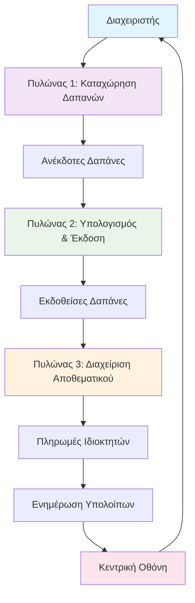
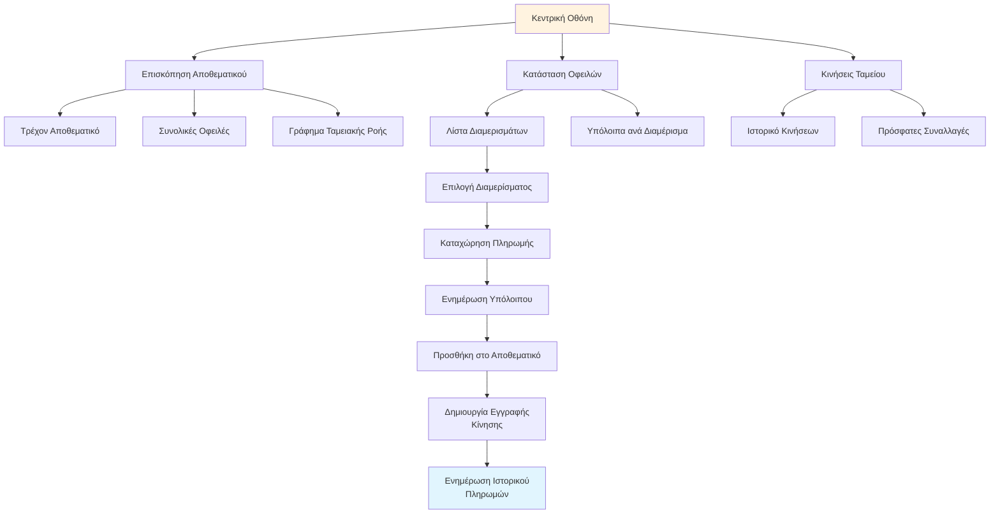
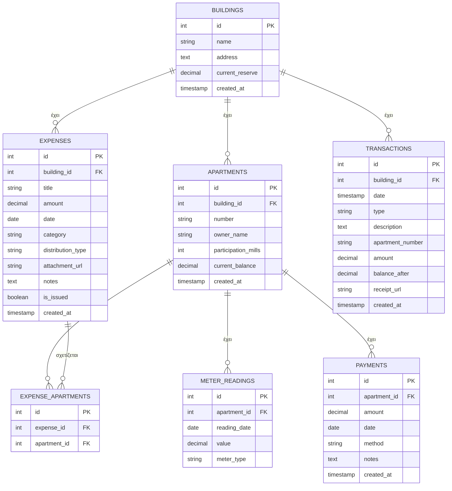
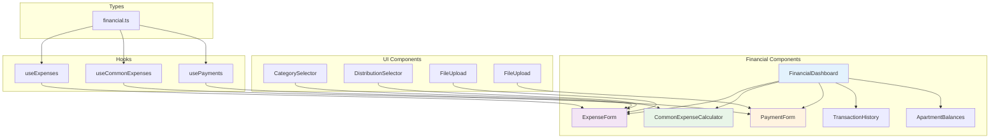
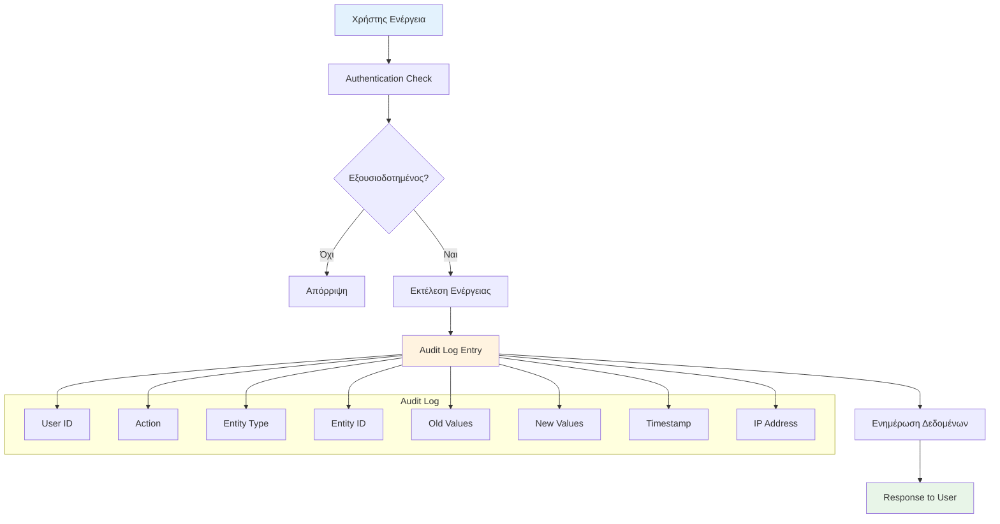

# 🔄 Οπτικό Διάγραμμα Ροής - Οικονομική Διαχείριση

## 📊 Κύριος Κύκλος Διαχείρισης



## 🎯 Πυλώνας 1: Καταχώρηση Δαπανών

```mermaid
flowchart TD
    A[Άνοιγμα "Νέα Δαπάνη"] --> B[Συμπλήρωση Βασικών Πεδίων]
    B --> C[Επιλογή Κατηγορίας]
    C --> D{Αυτόματη Πρόταση<br/>Τρόπου Κατανομής}
    D --> E[Επιβεβαίωση/Αλλαγή<br/>Τρόπου Κατανομής]
    E --> F{Ειδική Κατανομή?}
    F -->|Ναι| G[Επιλογή Συγκεκριμένων<br/>Διαμερισμάτων]
    F -->|Όχι| H[Προσθήκη Επισύναψης<br/>Παραστατικού]
    G --> H
    H --> I[Προσθήκη Σημειώσεων]
    I --> J[Αποθήκευση]
    J --> K[Μεταφορά σε<br/>"Ανέκδοτες Δαπάνες"]
    
    style A fill:#e3f2fd
    style K fill:#e8f5e8
```

## ⚙️ Πυλώνας 2: Υπολογισμός & Έκδοση

```mermaid
flowchart TD
    A[Άνοιγμα "Έκδοση Κοινοχρήστων"] --> B[Επιλογή Περιόδου]
    B --> C[Επισκόπηση Ανέκδοτων Δαπανών]
    C --> D{Υπάρχουν Δαπάνες<br/>Θέρμανσης?}
    D -->|Ναι| E[Εισαγωγή Μετρήσεων<br/>Ωρομετρητών]
    D -->|Όχι| F[Υπολογισμός Μεριδίων]
    E --> F
    F --> G[Προεπισκόπηση Αποτελεσμάτων]
    G --> H{Όλα Σωστά?}
    H -->|Όχι| I[Επεξεργασία Δαπανών]
    I --> F
    H -->|Ναι| J[Οριστική Έκδοση]
    J --> K[Αποστολή Ειδοποιητηρίων]
    K --> L[Ενημέρωση Οφειλών]
    L --> M[Μεταφορά σε<br/>"Εκδοθείσες Δαπάνες"]
    
    style A fill:#e8f5e8
    style M fill:#fff3e0
```

## 📊 Πυλώνας 3: Διαχείριση Αποθεματικού



## 🔄 Ροή Δεδομένων - Λεπτομερές Διάγραμμα

```mermaid
graph LR
    subgraph "Εισροή Δεδομένων"
        A1[Διαχειριστής] --> A2[Φόρμα Δαπάνης]
        A2 --> A3[Κατηγοριοποίηση]
        A3 --> A4[Αποθήκευση]
    end
    
    subgraph "Επεξεργασία"
        B1[Ανέκδοτες Δαπάνες] --> B2[Υπολογισμός Μεριδίων]
        B2 --> B3[Αλγόριθμος Κατανομής]
        B3 --> B4[Προεπισκόπηση]
        B4 --> B5[Έκδοση]
    end
    
    subgraph "Αποθήκευση & Διαχείριση"
        C1[Εκδοθείσες Δαπάνες] --> C2[Ενημέρωση Οφειλών]
        C2 --> C3[Κεντρική Οθόνη]
        C3 --> C4[Πληρωμές]
        C4 --> C5[Ενημέρωση Αποθεματικού]
    end
    
    subgraph "Αναφορά & Επιθεώρηση"
        D1[Κινήσεις Ταμείου] --> D2[Ιστορικό Πληρωμών]
        D2 --> D3[Αναφορές]
        D3 --> D4[Εξαγωγή Δεδομένων]
    end
    
    A4 --> B1
    B5 --> C1
    C5 --> D1
    
    style A1 fill:#e3f2fd
    style B2 fill:#e8f5e8
    style C3 fill:#fff3e0
    style D1 fill:#fce4ec
```



## 🗄️ Δομή Βάσης Δεδομένων



## 🎨 Αρχιτεκτονική Frontend Components



## 🔒 Ασφάλεια & Audit Trail



---

## 📋 Περίληψη Βασικών Αρχών

### 🎯 Βασικές Αρχές Σχεδιασμού
1. **Απλότητα**: Ελάχιστη πολυπλοκότητα για τον διαχειριστή
2. **Διαφάνεια**: Όλες οι κινήσεις είναι ορατές και καταγραμμένες
3. **Αυτοματοποίηση**: Ελάχιστη χειροκίνητη παρέμβαση
4. **Ασφάλεια**: Πλήρες audit trail και έλεγχος πρόσβασης
5. **Ευελιξία**: Υποστήριξη διαφορετικών τρόπων κατανομής

### 🔄 Κύριος Κύκλος Εργασίας
1. **Εισροή**: Καταχώρηση δαπανών με κατηγοριοποίηση
2. **Επεξεργασία**: Αυτόματος υπολογισμός και έκδοση
3. **Εικόνα**: Διαφανής διαχείριση αποθεματικού και πληρωμών
4. **Επιστροφή**: Ενημέρωση και αναφορά για νέο κύκλο

### 🎨 Βασικά Χαρακτηριστικά UI/UX
- **Intuitive Interface**: Εύκολη πλοήγηση και λειτουργία
- **Real-time Updates**: Άμεση ενημέρωση όλων των οθονών
- **Responsive Design**: Λειτουργία σε όλες τις συσκευές
- **Accessibility**: Προσβασιμότητα για όλους τους χρήστες 